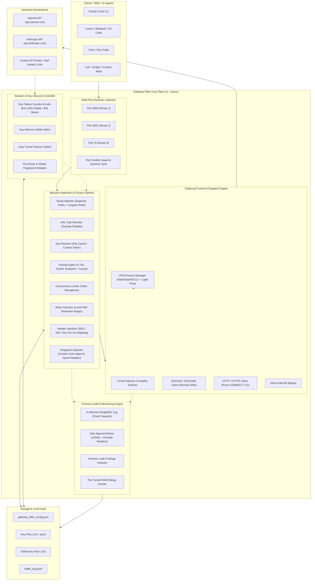
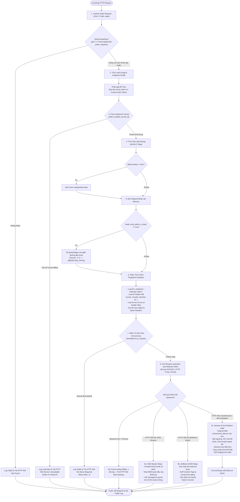
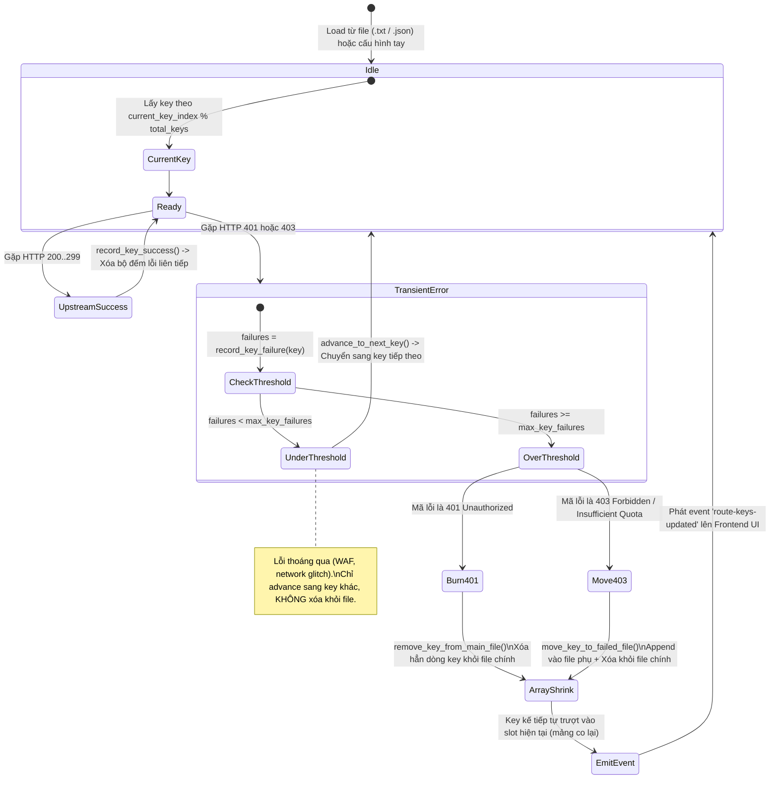
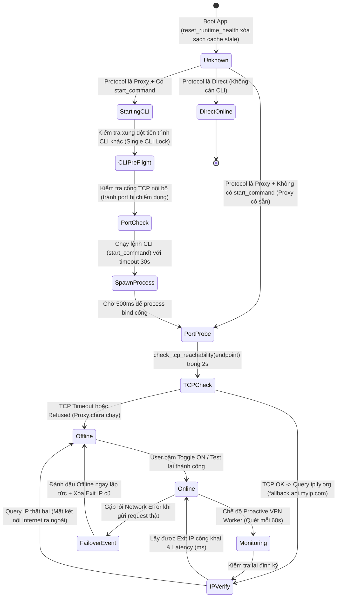

# Gateway Filter Architecture, Algorithms & Protocol Transformations

Tài liệu thiết kế chi tiết, sơ đồ thuật toán, ma trận chuyển đổi dữ liệu và báo cáo kiểm tra thiếu sót của **Gateway Filter** (Tauri v2 + Rust Axum Proxy Core + React UI).

---

## 1. Sơ Đồ Kiến Trúc Tổng Thể (System Architecture)

Gateway Filter đóng vai trò là một **Local Privacy & Traffic Filtering Proxy Gateway**, cung cấp các port lắng nghe độc lập cho từng Route, trung chuyển và khử dấu vết fingerprint, điều phối lưu lượng (Traffic Pacing), quản lý luân phiên API Key và định tuyến an toàn qua các Outbound Tunnel (SOCKS5, SOCKS5h, HTTP, HTTPS, Direct) kèm cơ chế điều khiển tiến trình VPN CLI (AdGuard, WARP).

---

## 2. Sơ Đồ Thuật Toán Xử Lý Request (Request Execution Flow)

Mọi HTTP request gửi đến bất kỳ port nào do Gateway Filter quản lý đều đi qua chu trình xử lý 10 bước nghiêm ngặt:

---

## 3. Sơ Đồ Thuật Toán Vòng Đời Key, Tunnel CLI & Session Rotation

### 3.1. Thuật toán Quản lý & Luân phiên API Key (Key Lifecycle & Burn Policy)
Hệ thống sử dụng cơ chế bảo vệ kép chống đốt key oan (`max_key_failures`, mặc định = 3):

---

### 3.2. Thuật toán Điều khiển & Kiểm tra Sức Khỏe Tunnel (Tunnel Health State Machine)
Đảm bảo tunnel không bị phantom status, không rò rỉ real IP khi boot hoặc đứt kết nối:

---

## 4. Ma Trận & Sơ Đồ Những Thứ Gateway Filter Chuyển Đổi (Transformations)

Bảng chi tiết các phép chuyển đổi, lọc dữ liệu và giả mạo danh tính mà Gateway Filter thực hiện:

| Hạng Mục Chuyển Đổi | Input Gốc (Từ Client / IDE) | Output Chuyển Đổi (Gửi Lên Upstream) | Cơ Chế & Vị Trí Code |
| :--- | :--- | :--- | :--- |
| **URL Path Rewriting** | Request gửi tới `http://127.0.0.1:3000/v1/chat/completions` với target `https://api.openai.com/v1` | `https://api.openai.com/v1/chat/completions` (Không bị lỗi lặp `/v1/v1`) | `proxy/routing.rs:build_target_url()` |
| **Authentication Injection** | Client không gửi header `Authorization` hoặc gửi key local tạm thời | Ghi đè `Authorization: Bearer sk-...` lấy từ Key File active hoặc `custom_auth_token` | `proxy/mod.rs:540-544` |
| **Hop-by-Hop Header Stripping** | Headers mạng: `Host`, `Content-Length`, `Connection`, `Keep-Alive`, `Transfer-Encoding`, `Upgrade` | Bị xóa bỏ hoàn toàn trước khi chuyển tiếp lên upstream và khi trả về client | `proxy/mod.rs:521-530`, `proxy/upstream.rs:66-72` |
| **SDK Telemetry Stripping** | `x-stainless-os`, `x-stainless-lang`, `x-stainless-arch`, `anthropic-client-version`, `anthropic-version` | Bị xóa bỏ nếu `strip_sdk_headers: true` | `fingerprint/sanitizer.rs:19-21` |
| **IDE & Machine ID Stripping** | Headers chứa: `cursor-*`, `vscode-*`, `x-machine-id`, `x-session-id`, `x-client-id` | Bị xóa bỏ nếu `strip_ide_headers: true` | `fingerprint/sanitizer.rs:24-31` |
| **Browser Client Hints Stripping** | Headers bắt đầu bằng `sec-ch-ua`, `sec-ch-ua-platform`, `sec-ch-ua-mobile` | Bị xóa bỏ nếu `strip_sec_ch_ua: true` | `fingerprint/sanitizer.rs:34-36` |
| **User-Agent Spoofing** | User-Agent của Cursor/VSCode/Python/Curl (ví dụ `curl/8.5.0` hoặc `Cursor/0.45.0`) | Chuỗi trình duyệt chuẩn: `Mozilla/5.0 (Windows NT 10.0; Win64; x64) Chrome/133.0.0.0 Safari/537.36` | `fingerprint/sanitizer.rs:44-57` |
| **Header Overwrite (Spoofing)** | Header tùy biến người dùng định nghĩa | Ghi đè hoặc xóa bỏ (nếu giá trị rỗng) qua cấu hình `spoof_headers` | `fingerprint/sanitizer.rs:60-67` |
| **Local Path Masking (Body)** | Payload chứa đường dẫn cá nhân: `"/home/bimatkeo/project/src"` hoặc `"C:\\Users\\Admin\\project"` | Bị thay thế bằng chuỗi `"[REDACTED_PATH]"` trước khi gửi upstream | `fingerprint/patterns.rs:mask_local_paths()` |
| **Traffic Pacing (Delay Injection)** | Request gửi liên tục tức thời (burst traffic) | Bị hoãn lại (sleep) một khoảng thời gian tính theo thuật toán GCRA để giãn cách request | `proxy/mod.rs:compute_pacing_slot()` |
| **Concurrency Throttling** | Số lượng request đồng thời vượt quá `max_concurrent_streams` của tunnel | Chuyển đổi thành HTTP 429 Too Many Requests kèm header `Retry-After: 2` | `proxy/mod.rs:547-584` |
| **SSE Stream Sniffing** | Luồng sự kiện Server-Sent Events (SSE) vô tận từ upstream | Tách nhánh (tee) tối đa 4096 bytes đầu tiên vào bộ đệm RAM để hiển thị Traffic Inspector | `proxy/upstream.rs:83-93` |
| **Response Body Truncation** | Response nhị phân (ảnh, audio, video) hoặc gzip/brotli nén | Chuyển thành nhãn tóm tắt: `[Compressed Data: gzip \| 102400 bytes]` hoặc `[Binary Media: ...]` | `proxy/mod.rs:format_logged_body()` |
| **AdGuard Dynamic Location** | Cấu hình location: `"random"`, `"fastest"` hoặc chọn cụ thể | Bốc ngẫu nhiên ISO từ `list-locations`, sinh cờ `-l "<loc>"` hoặc `-f` để đổi IP/subnet liên tục | `vpn/process.rs:fetch_adguard_locations()`, `commands.rs:140-165` |

---

## 5. Báo Cáo Kiểm Tra & Đánh Giá Toàn Diện (Deficiency Resolution & Status)

Toàn bộ các thiếu sót, lỗ hổng kỹ thuật và yêu cầu kiến trúc đã được xử lý triệt để trong mã nguồn:

### 5.1. Khắc Phục Lỗi "Đổi Mã Lỗi Nhưng Vẫn Trả Đúng Nội Dung" (ĐÃ HOÀN TẤT)
- **Cơ chế triển khai**: Trong [proxy/upstream.rs](file:///home/bimatkeo/Documents/SH/RS_AI/GUI/gateway_filter/backend/src/proxy/upstream.rs):
  - Khi upstream trả về `401 Unauthorized` hoặc `403 Forbidden`, hệ thống ghi nhận sự kiện, kích hoạt bộ đếm xoay key/session.
  - **Khi phản hồi về Client / IDE**: Gateway tự động map mã trạng thái thành `StatusCode::BAD_GATEWAY` (502).
  - **Bảo toàn 100% Header và Response Body JSON gốc**: Client nhận nguyên vẹn thông báo lỗi chi tiết từ upstream (`{"error": {"message": "Invalid API key / Quota exceeded"}}`) để hiển thị lên chatbox cho người dùng, đồng thời ngăn chặn các IDE (Cursor, Cline, Windsurf) kích hoạt cơ chế tự xóa credential hoặc hủy session token.

### 5.2. Chuyển Đổi Giao Thức LLM (DỰ TÍNH SẮP LÀM)
- **Định hướng**: Dự án đã lên kế hoạch bổ sung bộ chuyển đổi giao thức LLM (OpenAI Chat Completions <-> Anthropic Messages) theo lộ trình phát triển tiếp theo. Tái sử dụng hoặc bridge với engine chuyển đổi từ [universal_api/protocol.rs](file:///home/bimatkeo/Documents/SH/RS_AI/GUI/universal_api/backend/src/core/protocol.rs).

### 5.3. Xử Lý Regex Masking Đa Nền Tảng (ĐÃ HOÀN TẤT)
- **Cơ chế triển khai**: Trong [fingerprint/patterns.rs](file:///home/bimatkeo/Documents/SH/RS_AI/GUI/gateway_filter/backend/src/fingerprint/patterns.rs):
  - Mở rộng `LOCAL_PATH_REGEX` bao phủ:
    1. macOS: `/Users/<username>/...`
    2. Linux: `/root/...`, `/tmp/...`, `/var/...`, `/etc/...`, `/home/...`
    3. Windows: `C:\...` và dạng JSON escaped backslash `C:\\...`
  - Đã xác thực qua unit test `test_mask_local_paths_only_when_matched` bảo vệ an toàn toàn diện các đường dẫn nhạy cảm.

### 5.4. Khắc Phục Treo Stream SSE & Rò Rỉ Semaphore Permit (ĐÃ HOÀN TẤT)
- **Cơ chế triển khai**: Trong [proxy/upstream.rs](file:///home/bimatkeo/Documents/SH/RS_AI/GUI/gateway_filter/backend/src/proxy/upstream.rs):
  - Bọc luồng byte stream trong `futures_util::stream::unfold` kèm `tokio::time::timeout(45s)`.
  - Nếu VPN đứt ngầm hoặc upstream câm lặng quá 45 giây giữa 2 chunk, stream tự động ngắt kết nối.
  - `StreamGuard` được drop ngay lập tức, giải phóng `OwnedSemaphorePermit` cho tunnel, loại trừ hoàn toàn nguy cơ nghẽn hàng đợi (Permit Leak).

### 5.5. Bất Đồng Bộ Giữa RAM Log Và Disk Log Khi Streaming (ĐÃ HOÀN TẤT)
- **Cơ chế triển khai**: Trong [monitor/disk.rs](file:///home/bimatkeo/Documents/SH/RS_AI/GUI/gateway_filter/backend/src/monitor/disk.rs) & [proxy/upstream.rs](file:///home/bimatkeo/Documents/SH/RS_AI/GUI/gateway_filter/backend/src/proxy/upstream.rs):
  - Bổ sung `update_disk_log_response_body` & `spawn_disk_update_response_body`.
  - Khi stream hoàn tất (hoặc bị ngắt), hàm drop của `StreamGuard` tự động đồng bộ response body hoàn chỉnh tích lũy trong RAM xuống file `traffic_log.jsonl` qua worker pool độc lập.

### 5.6. Khắc Phục Race Condition Khi Ghi File Key (Atomic Write-Back) (ĐÃ HOÀN TẤT)
- **Cơ chế triển khai**: Trong [proxy/key_manager.rs](file:///home/bimatkeo/Documents/SH/RS_AI/GUI/gateway_filter/backend/src/proxy/key_manager.rs):
  - Mọi thao tác loại bỏ key chết (`remove_key_from_main_file`) đều ghi ra tệp tạm `.key.tmp.<uuid>` trong cùng thư mục rồi thực hiện `std::fs::rename`.
  - Đảm bảo tính nguyên tử (atomic) trên cả POSIX và NTFS, loại trừ nguy cơ hỏng tệp khi mất điện hoặc crash ứng dụng.

### 5.7. Cải Thiện Khóa Độc Quyền CLI (Port & Binary Scoped Lock) (ĐÃ HOÀN TẤT)
- **Cơ chế triển khai**: Trong [commands.rs](file:///home/bimatkeo/Documents/SH/RS_AI/GUI/gateway_filter/backend/src/commands.rs):
  - Thay thế khóa độc quyền toàn cục cứng nhắc bằng `find_conflicting_cli_tunnel` và `extract_cli_binary`.
  - Hệ thống chỉ ngăn chặn khi 2 tunnel dùng **cùng endpoint/port TCP** hoặc **cùng một tệp thực thi CLI** (chống xung đột daemon OS).
  - Cho phép chạy song song các CLI tunnel khác nhau (ví dụ: WARP port 40000 + AdGuard port 1080) để phục vụ đồng thời nhiều route độc lập.

### 5.8. Kiến Trúc Multi-Port Độc Lập Cho Từng Endpoint (CHỦ ĐÍCH THIẾT KẾ)
- **Quyết định thiết kế**: Giữ nguyên kiến trúc mỗi RouteRule mở một cổng lắng nghe độc lập (ví dụ Port 3000, 3001, 3002).
- **Lý do**: Cho phép người dùng gán cứng từng AI client/IDE vào một endpoint chuyên biệt, đảm bảo cô lập 100% về mặt cấu hình, API key, tunnel định tuyến và profile chống lộ danh tính; ngăn chặn hoàn toàn việc nhầm lẫn hoặc xung đột model/context giữa các công cụ làm việc khác nhau.

### 5.9. Khắc Phục Giả Mạo TLS & Tối Ưu Hóa Transport Layer (ĐÃ HOÀN TẤT)
- **Cơ chế triển khai**: Trong [vpn/network.rs](file:///home/bimatkeo/Documents/SH/RS_AI/GUI/gateway_filter/backend/src/vpn/network.rs):
  - Bật `tcp_nodelay(true)` (truyền tức thì từng SSE token, vô hiệu hóa Nagle's algorithm).
  - Bật `tcp_keepalive(60s)` (giữ TCP socket sống qua NAT / tường lửa của VPN).
  - Cấu hình `pool_idle_timeout(90s)` và `pool_max_idle_per_host(10)` để tái sử dụng kết nối hiệu quả mà không bị giữ kết nối chết.
  - Sử dụng `rustls-tls` với cipher suite hiện đại và ALPN chuẩn.

### 5.10. Quản Lý Vị Trí Động AdGuard VPN (AdGuard Dynamic Locations) (ĐÃ HOÀN TẤT)
- **Cơ chế triển khai**:
  - Backend: `fetch_adguard_locations` (sử dụng fallback `--bash-completion ""` hoạt động 100% ngay cả khi chưa login), `pick_random_adguard_location` bằng CSPRNG, và IPC command `get_adguard_locations`.
  - Frontend: Thêm Dropdown chọn vị trí kết nối trong modal cấu hình Tunnel (cho phép chọn `Ngẫu nhiên (Mặc định)`, `Nhanh nhất (Fastest -f)` hoặc từng quốc gia cụ thể).

