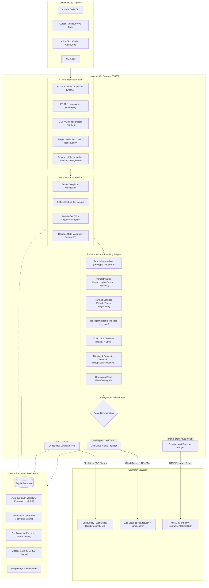
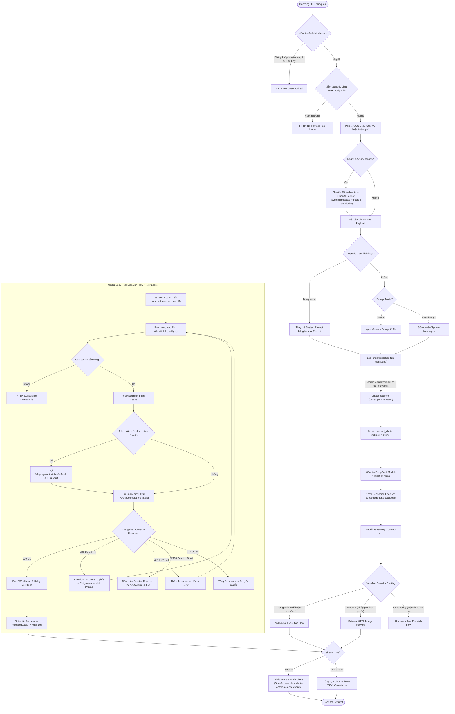
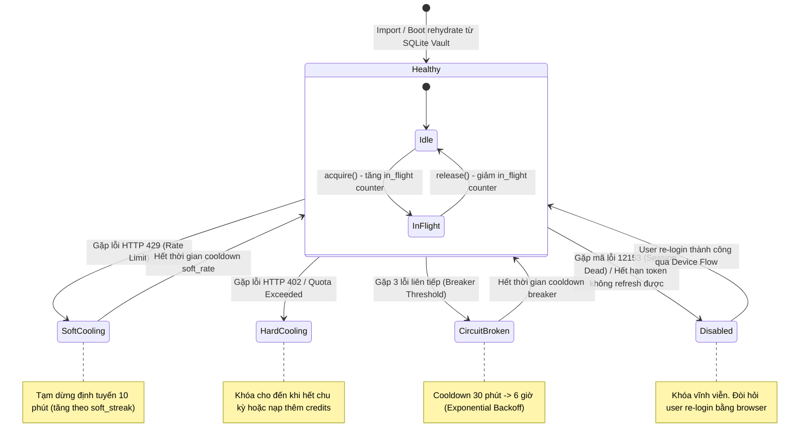

# Universal API Architecture, Algorithms & Protocol Transformations

Tài liệu thiết kế chi tiết, sơ đồ thuật toán và ma trận chuyển đổi dữ liệu của **Universal API Gateway** (Tauri v2 + Rust Axum Core + React UI).

---

## 1. Sơ Đồ Kiến Trúc Tổng Thể (System Architecture)

Universal API đóng vai trò là một **Unified Local Gateway (Reverse Proxy & Protocol Translator)**, cung cấp các endpoint chuẩn OpenAI (`/v1/*`) và Anthropic (`/v1/messages`), tiếp nhận request từ các client (Claude Code, Cursor, Cline, Zed, v.v.), sau đó định tuyến và chuyển đổi tương ứng đến 3 nhánh provider upstream.

---

## 2. Sơ Đồ Thuật Toán Xử Lý Request (Request Execution Flow)

Mọi request đi vào gateway đều trải qua chu trình tuần tự: xác thực -> chuẩn hóa protocol -> rewriting payload -> lựa chọn provider -> truyền phát stream hoặc tổng hợp response.

---

## 3. Sơ Đồ Thuật Toán Vòng Đời Account Pool & Failover

Cơ chế điều phối tài khoản trong `core/pool.rs` bảo vệ tài khoản khỏi bị ban hoặc cạn kiệt quota bằng các cơ chế:
1. **Weighted Selection**: Ưu tiên tài khoản còn nhiều credit, có thời gian nghỉ dài (idle bonus) và ít in-flight request.
2. **Session Sticky**: Ghép cố định user-id với account-uid trong 30 phút để giữ context.
3. **Tri-State Cooldown**: SoftRate (10 phút khi dính 429), HardCredit (khóa tới khi nạp khi dính 402), SessionDead (khóa vĩnh viễn khi mã lỗi 12153).

---

## 4. Ma Trận & Sơ Đồ Những Thứ Universal API Chuyển Đổi (Transformations)

Bảng chi tiết các phép chuyển đổi mà Universal API thực hiện trên từng tầng của request và response:

| Hạng Mục Chuyển Đổi | Input Gốc (Từ Client) | Output Chuyển Đổi (Gửi Lên Upstream) | Cơ Chế & Vị Trí Code |
| :--- | :--- | :--- | :--- |
| **Giao Thức Request** | Anthropic `/v1/messages` (JSON: `system`, `messages[]` dạng text blocks) | OpenAI-compatible `OpenAIChatRequest` (`role: "system"`, `role: "user"`, `role: "assistant"`) | `core/protocol.rs:to_openai()` |
| **Role Normalization** | `role: "developer"` (chuẩn OpenAI o-series) | `role: "system"` (chuẩn tương thích upstream whitelist) | `core/upstream/payload.rs:normalize_roles()` |
| **Tool Choice Normalization** | `{"type": "function", "function": {"name": "xyz"}}` | Chuỗi: `"xyz"` hoặc `"auto"` / `"none"` | `core/upstream/payload.rs:normalize_tool_choice()` |
| **DeepSeek Thinking Injection** | Model chứa `deepseek` + `think`/`reason` (chưa có trường `thinking`) | Thêm `thinking: {"type": "enabled", "budget_tokens": 10000}`, xóa `temperature` | `core/upstream/thinking.rs:inject_thinking()` |
| **Reasoning Effort Mapping** | `reasoning_effort: "xhigh"` (tùy ý) | Khớp bậc (`off` < `minimal` < `low` < `medium` < `high` < `max`) với `supportedEfforts` của model | `core/upstream/payload.rs:normalize_reasoning_effort()` |
| **Reasoning Content Backfill** | Model trả về `reasoning_content` nhưng `content` rỗng | Chuyển `content` thành `<think>\n{reasoning_content}\n</think>` | `core/upstream/thinking.rs:backfill_reasoning_content()` |
| **Fingerprint Sanitization** | Chứa header `x-anthropic-billing-header`, biến `cc_entrypoint=`, text *"You are Claude Code, Anthropic's official CLI..."* | Xóa bỏ header và key-value, đổi câu tự nhận dạng thành *"official CLI tool for Claude"* | `core/upstream/sanitize.rs` |
| **Header Spoofing** | Headers thô từ client (Curl, Cursor, Cline...) | Spoof danh tính CLI chính thức: `X-IDE-Name: CLI`, `X-IDE-Version: 2.137.1`, `X-Product: SaaS`, UUID v4 Request IDs | `core/upstream/headers.rs:chat_headers()` |
| **Zed Cloud Protocol** | OpenAI/Anthropic Chat Request | Zed Cloud Request: `{provider, model, provider_request}` (định dạng theo Anthropic/Google/OpenAI/xAI) | `core/providers/zed.rs:build_provider_request()` |
| **Zed Cloud Response** | NDJSON thô từ Zed Cloud (`type: content_block_delta`, `response.output_text.delta`...) | SSE OpenAI standard (`choices[0].delta.content`) hoặc Anthropic SSE Events | `core/providers/zed.rs:parse_completion()` |
| **Non-Streaming Aggregation** | Client gửi `stream: false` | Gộp chuỗi SSE `data: {...}` thành JSON đơn lẻ `chat.completion` kèm `finish_reason` và `tool_calls` | `core/upstream/sse.rs:aggregate()` |
| **Anthropic SSE Streaming** | Upstream trả về SSE OpenAI (`choices[0].delta.content`) | Chuyển phát thành Anthropic SSE: `message_start` -> `content_block_start` -> `content_block_delta` -> `content_block_stop` -> `message_delta` -> `message_stop` | `core/server.rs:835-860` |

---

## 5. Báo Cáo Kiểm Tra & Đánh Giá Thiếu Sót (Gap Analysis & Deficiencies)

Sau khi kiểm tra toàn bộ mã nguồn backend, bridge và frontend, đây là danh sách các thiếu sót, lỗ hổng kỹ thuật và điểm cần cải tiến của `universal_api`:

### 5.1. Thiếu sót nghiêm trọng trong Chuyển Đổi Giao Thức Anthropic (`/v1/messages`)
- **Mất mát Tools & Tool Calling**: Trong [protocol.rs](file:///home/bimatkeo/Documents/SH/RS_AI/GUI/universal_api/backend/src/core/protocol.rs#L93-L160), hàm `to_openai()` chỉ bóc tách text thuần từ `m.content`. Nếu client gửi block dạng `tool_use`, `tool_result` (bắt buộc khi chạy Claude Code / Cline / Agentic workflow), toàn bộ cấu trúc này bị mất hoặc bị biến thành chuỗi JSON thô vô nghĩa.
- **Thiếu Anthropic Tool Streaming Output**: Khi streaming về client Anthropic ([server.rs:845-857](file:///home/bimatkeo/Documents/SH/RS_AI/GUI/universal_api/backend/src/core/server.rs#L845-L857)), code chỉ chuyển `content` thành `content_block_delta`. Không hỗ trợ phát sinh `tool_use` event (`content_block_start` dạng tool, `input_json_delta`). Do đó, các agent gọi tool qua `/v1/messages` sẽ bị lỗi parse cú pháp tool call.
- **Không hỗ trợ Multimodal (Hình ảnh / Documents)**: `AnthropicMessage` không chuyển đổi base64 image sang chuẩn OpenAI Image URL format.

### 5.2. Stream Giả Lập (Buffering thay vì True Streaming) ở Zed và External Providers
- **Zed Native Provider**: Trong [providers/zed.rs](file:///home/bimatkeo/Documents/SH/RS_AI/GUI/universal_api/backend/src/core/providers/zed.rs#L960-L998), hàm `chat_once` dùng `ureq` tải **toàn bộ response NDJSON** từ Zed Cloud vào bộ nhớ, parse xong xuôi rồi mới phát 1-2 event SSE tổng hợp về client. Thời gian TTFB (Time-To-First-Byte) bị trễ bằng đúng thời gian hoàn thành cả câu trả lời.
- **External Provider**: Trong [external.rs](file:///home/bimatkeo/Documents/SH/RS_AI/GUI/universal_api/backend/src/core/external.rs#L530-L536), hàm `forward_chat` dùng `read_to_end` nạp tối đa 32MB vào buffer rồi mới duyệt qua `lines()`. Điều này khiến tính năng streaming của external provider cũng bị biến thành buffer-then-flush.
- **Chỉ có CodeBuddy Pool là True Streaming**: Duy nhất nhánh CodeBuddy Upstream ([server.rs:808-860](file:///home/bimatkeo/Documents/SH/RS_AI/GUI/universal_api/backend/src/core/server.rs#L808-L860)) là đọc dòng nào phát dòng đó ngay lập tức ra SSE channel.

### 5.3. Hạn Chế của Zed Native Provider
- **Chặn đứng Tools & Hình ảnh**: Hàm `extract_text` tại [providers/zed.rs:418-422](file:///home/bimatkeo/Documents/SH/RS_AI/GUI/universal_api/backend/src/core/providers/zed.rs#L418-L422) chủ động trả lỗi `Err("zed native v1 supports text messages only...")` nếu phát hiện block hình ảnh hoặc công cụ.
- **Không có OAuth Login tự động**: Trong khi CodeBuddy có đầy đủ Browser Device-Flow Login ([login.rs](file:///home/bimatkeo/Documents/SH/RS_AI/GUI/universal_api/backend/src/core/login.rs)), Zed provider hoàn toàn phụ thuộc vào việc người dùng phải tự tìm và trỏ đường dẫn tới file credential JSON có sẵn trên đĩa.

### 5.4. Độ Chính Xác của Token Usage Tracking
- **Đếm Chunk thay vì đếm Token**: Tại [server.rs:827](file:///home/bimatkeo/Documents/SH/RS_AI/GUI/universal_api/backend/src/core/server.rs#L827), biến `total_tokens` được tăng bằng `total_tokens += 1` cho mỗi dòng `data:` SSE nhận được. Một câu trả lời 500 token nếu được truyền trong 40 chunk SSE thì hệ thống chỉ ghi nhận là 40 tokens! Báo cáo metrics và usage log bị sai lệch hoàn toàn so với thực tế.
- **Chưa parse trường `usage` từ event cuối**: Không trích xuất `prompt_tokens` và `completion_tokens` từ chunk kết thúc của OpenAI.

### 5.5. Thiếu Endpoints Chuẩn của OpenAI Spec
- Không có endpoint `/v1/embeddings` (nhiều IDE như Cursor hay VS Code dùng để index codebase).
- Không có endpoint `/v1/models/{model_id}` (kiểm tra metadata của một model cụ thể).

### 5.6. Vấn Đề Frontend & Kiến Trúc Dự Án
- **Thư mục `components/` trống**: Thư mục [frontend/src/components](file:///home/bimatkeo/Documents/SH/RS_AI/GUI/universal_api/frontend/src/components) hoàn toàn rỗng. Toàn bộ logic giao diện của các modal, bảng biểu, danh sách đang bị viết inline trực tiếp vào các file trang (`pages/*.tsx`), làm giảm khả năng bảo trì và tái sử dụng.
- **Thiếu giao diện xem Usage Logs**: Backend SQLite đã có bảng `usage_logs` và API `list_usage_logs`, `get_usage_summary`, nhưng Frontend chưa có trang riêng để thống kê chi tiết lượng token và request tiêu thụ theo từng Access Key.
- **Tài liệu `plan.md` lỗi thời**: Tệp [plan.md](file:///home/bimatkeo/Documents/SH/RS_AI/GUI/universal_api/plan.md) vẫn ghi `Current: Phase 1 active. Next gate: cargo check on scaffold` dù toàn bộ 10 phase đã được hoàn thiện code.

---

## 6. Lộ Trình Khắc Phục Khuyến Nghị (Actionable Roadmap)

1. **Nâng cấp `protocol.rs`**:
   - Thêm bộ chuyển đổi 2 chiều cho `tools` và `tool_choice` giữa OpenAI <-> Anthropic.
   - Hỗ trợ phát sinh các event `content_block_start` (type `tool_use`) và `content_block_delta` (type `input_json_delta`) khi relay Anthropic SSE stream.
2. **Khắc phục True Streaming cho External & Zed**:
   - Chuyển `forward_chat` và `chat_once` sang cơ chế stream reader (dùng `BufReader::lines()` tương tự như CodeBuddy client) thay vì nạp toàn bộ body qua `read_to_end`.
3. **Chuẩn hóa Token Counting**:
   - Parse object `usage` từ event kết thúc của upstream stream để lấy số `prompt_tokens` và `completion_tokens` chính xác thay vì đếm số dòng chunk SSE.
4. **Bổ sung UI Usage**:
   - Tạo trang hoặc tab phụ `Usage Dashboard` trong giao diện để hiển thị biểu đồ và bảng log tiêu thụ token theo từng local Access Key.
5. **Cập nhật `plan.md` & Modularize Components**:
   - Tách các modal/card trong `pages/*.tsx` vào thư mục `components/` và đánh dấu hoàn tất các phase trong `plan.md`.
