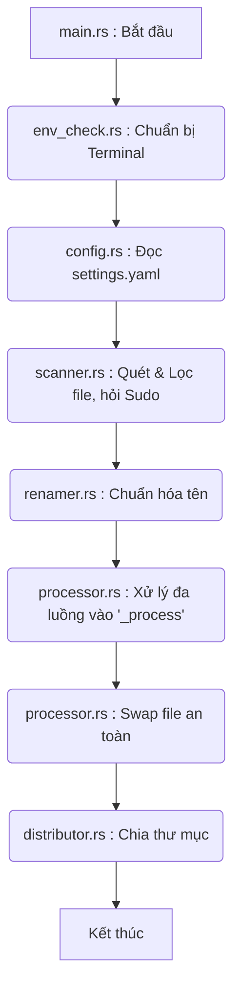

# Lộ trình Dòng Chảy Mã Nguồn (Code Flow) & Tư Duy Hệ Thống

Để có cái nhìn rõ ràng nhất về cách hệ thống hoạt động từ lúc bắt đầu cho đến khi kết thúc, chúng ta sẽ đi theo **Dòng chảy mã nguồn (Code Flow)**. 

Khối bắt đầu (Entry point) của toàn bộ chương trình nằm ở hàm `main()` trong file `src/main.rs`. Từ đây, nó sẽ đóng vai trò như một "nhạc trưởng" (Orchestrator) gọi đến các khối (module) khác theo một trình tự nghiêm ngặt.

Dưới đây là luồng thực thi chi tiết, gắn liền với các bài học về Systems Thinking.

---

## 1. Khởi tạo & Giao tiếp Môi trường (Environment Bootstrapping)
**File thực thi:** `src/main.rs` gọi `src/env_check.rs`

*   **Luồng Code:**
    *   Ngay khi hàm `main()` chạy (dòng 20, `main.rs`), nó kiểm tra xem nó có đang chạy trong một Terminal thực sự không (`is_terminal()`). Nếu bạn double-click vào file từ thư mục (GUI), nó sẽ tự động gọi hệ điều hành sinh ra một Terminal mới để chứa nó.
    *   Sau đó gọi `env_check::resize_terminal()` để ép kích thước cửa sổ.
    *   Gọi `env_check::check_ffmpeg()` để dò tìm các công cụ hệ thống.
*   **Góc nhìn Systems Thinking (Boundaries):** Hệ thống không mù quáng chạy thuật toán ngay. Nó dành những mili-giây đầu tiên để "cảm nhận" ranh giới của mình và đảm bảo môi trường (Terminal, Dependencies) đã sẵn sàng.

## 2. Nạp Cấu Hình (Configuration Injection)
**File thực thi:** `src/main.rs` gọi `src/config.rs`

*   **Luồng Code:**
    *   Hàm `main()` gọi tiếp `config::load_or_create_settings()` (dòng 50, `main.rs`).
    *   Module này sẽ quét thư mục xem có file `settings.yaml` chưa. Nếu có, nó nạp vào bộ nhớ (struct `Settings`). Nếu chưa, nó tạo ra một file mẫu.
*   **Góc nhìn Systems Thinking (Causality):** File `config.rs` là khởi nguồn của "Tính nhân quả" (Causality). Biến `settings` này sau đó sẽ được bơm (inject) xuống các module bên dưới (`processor` và `distributor`). Mọi sự thay đổi ở đây sẽ tạo ra hiệu ứng cánh bướm lên toàn bộ hệ thống ở cuối quy trình.

## 3. Thu Thập Dữ Liệu & Vòng Lặp Sửa Lỗi (Data Gathering & Feedback Loop)
**File thực thi:** `src/main.rs` gọi `src/scanner.rs`

*   **Luồng Code:**
    *   Hàm `main()` gọi `scanner::scan_files()` (dòng 56, `main.rs`).
    *   File `scanner.rs` sẽ đọc thư mục hiện tại. Khối này sẽ chủ động loại bỏ các file không liên quan (như file `.exe`, file `.bat`, file `.yaml`).
    *   **Đặc biệt:** Nếu nó gặp file bị khóa (Permission Denied), nó không crash. Nó kích hoạt một vòng lặp hỏi người dùng nhập mật khẩu `sudo` và tự khởi động lại chính mình bằng quyền root.
*   **Góc nhìn Systems Thinking (Feedback Loops):** Đây là vòng lặp phản hồi cân bằng (Balancing Loop). Khi hệ thống gặp lực cản của môi trường (thiếu quyền), nó phản hồi lại bằng cách nâng cấp quyền hạn của chính nó để duy trì mục tiêu.

## 4. Tiền Xử Lý: Đổi Tên (Preprocessing)
**File thực thi:** `src/main.rs` gọi `src/renamer.rs`

*   **Luồng Code:**
    *   Danh sách file (sau khi qua `scanner`) được đưa vào `renamer::rename_files(&mut files)` (dòng 65, `main.rs`).
    *   Khối này sẽ sửa đổi trực tiếp tên các file trong ổ cứng để xóa các ký tự rác, thêm số 0 padding (ví dụ: `1.jpg` thành `01.jpg`). Đầu ra của nó là danh sách file đã sạch sẽ.

## 5. Xử Lý Cốt Lõi: Đa luồng & Phục Hồi (Core Processing)
**File thực thi:** `src/main.rs` gọi `src/processor.rs`

*   **Luồng Code:**
    *   `main.rs` lọc lại danh sách chỉ lấy ảnh, sau đó gọi `processor::process_files(&image_files, &settings)` (dòng 75).
    *   **Khối `processor.rs` làm 2 việc rất quan trọng:**
        1.  Nó đọc biến `settings.threads` và dùng thư viện `rayon` để chẻ nhỏ danh sách ảnh ra, nhồi vào nhiều CPU cùng lúc (Multi-threading). 
        2.  Nó KHÔNG lưu đè file gốc. Nó sinh ra một thư mục tạm `_process` và ra lệnh cho `ffmpeg` ghi ảnh mới vào đó.
    *   Tiếp theo, `main.rs` gọi `processor::swap_directories()` (dòng 80). Khối này sẽ di chuyển ảnh cũ vào thư mục `_old` và kéo ảnh từ `_process` ra ngoài một cách an toàn.
*   **Góc nhìn Systems Thinking (Emergence & Resilience):**
    *   **Emergence (Tính trồi):** Sự kết hợp giữa danh sách ảnh + đa luồng `rayon` tạo ra tốc độ kinh ngạc mà một thuật toán tuyến tính không có.
    *   **Resilience (Khả năng phục hồi):** Chế độ Out-of-place (dùng thư mục `_process`) đảm bảo hệ thống bất tử trước sự cố mất điện hay lỗi RAM.

## 6. Phân Phối Đầu Ra (Distribution)
**File thực thi:** `src/main.rs` gọi `src/distributor.rs`

*   **Luồng Code:**
    *   Sau khi thao tác xử lý ảnh xong, `main.rs` quét lại thư mục một lần nữa để lấy danh sách ảnh mới nhất (dòng 84).
    *   Gọi `distributor::distribute_files(&final_files, &settings)` (dòng 87).
    *   Khối `distributor.rs` đọc biến `settings.folder_distribution_mode` (Balanced, Greedy, hoặc Fixed). Nó làm các phép toán chia để biết file nào vào folder nào, tạo thư mục con (VD: `Chapter 1`), và di chuyển (move) file vào đó.
*   **Góc nhìn Systems Thinking (Interconnectedness):** Khối này là điểm cuối cùng tiếp nhận mọi thành quả từ các khối trước. Nếu `renamer.rs` đổi tên sai thứ tự, `distributor.rs` sẽ chia sai Chapter. Sự phụ thuộc lẫn nhau này nhấn mạnh tầm quan trọng của việc truyền tải Dữ Liệu Sạch (Clean Data) giữa các khối.

---

## Tóm tắt Sơ đồ Gọi Hàm (Call Tree)
Bạn có thể hình dung toàn bộ dự án này hoạt động theo trình tự sau:

