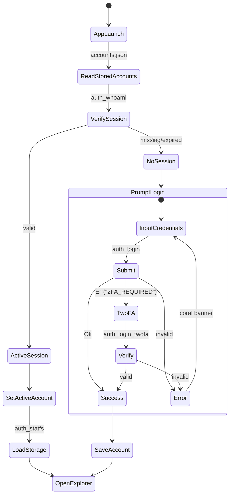
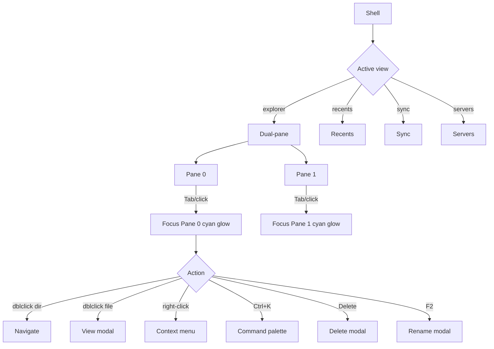
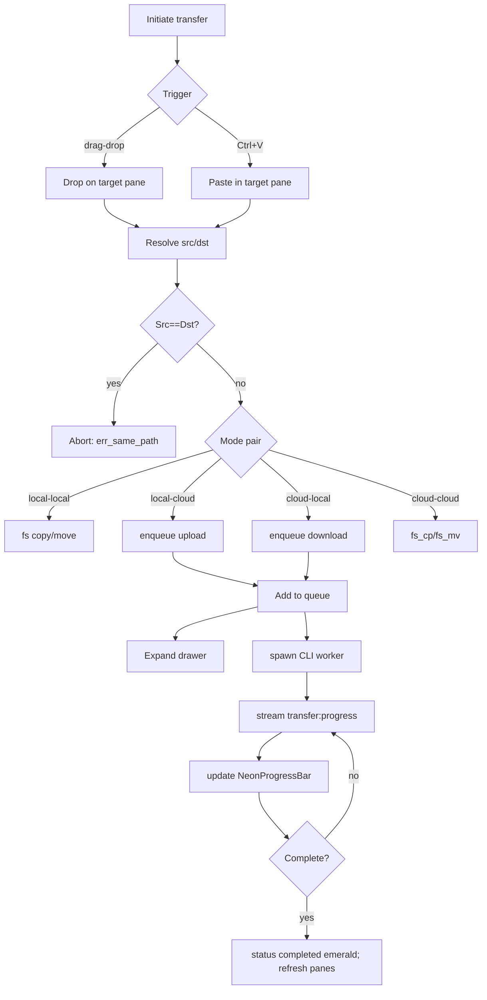
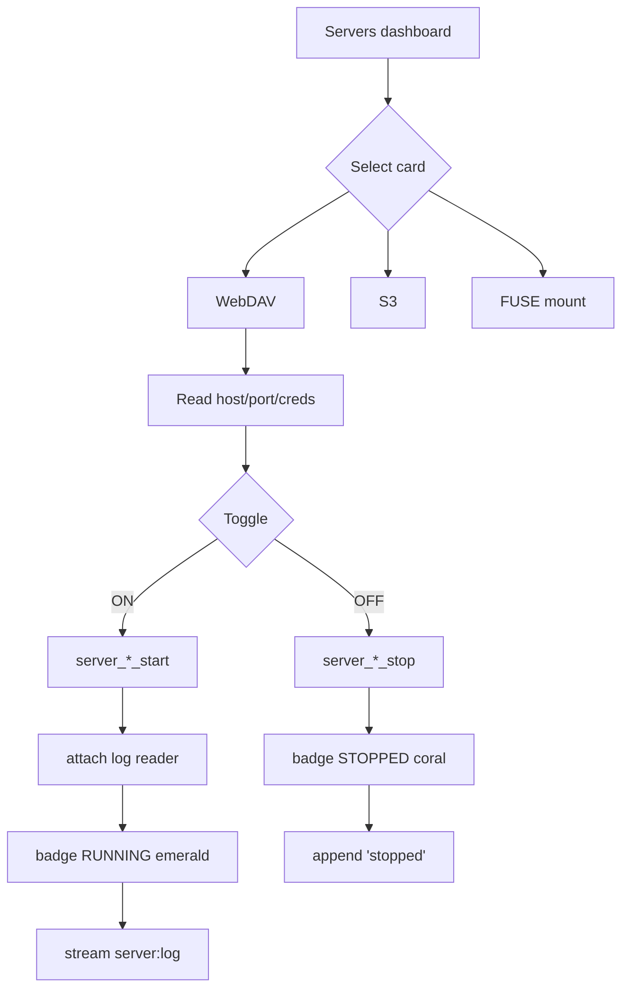

<!-- INTEGRITY NOTES: UI spec for filen_gui v3.0.0 Tauri v2 frontend (HTML/CSS/TS). -->
<!-- Purpose: Map neon_ui_design.md (egui — migration từ v2.0.0) onto a web frontend. Every color = var(--token) from design-tokens.md; every label = t(key) from i18n-and-themes.md. -->
<!-- Source of truth: docs/design-tokens.md (tokens) · docs/app-shell.md (shell/commands/events) · docs/neon_ui_design.md (layout/screens/flows/hotkeys/state) · docs/i18n-and-themes.md (lang_id). -->
<!-- Sub-doc #4 of docs v3.0.0 set — hub: docs/neon_ui_design.md. -->

# `filen_gui` UI Spec — Tauri v2 Frontend (HTML/CSS/TS)

**Version**: 3.0.0
**Status**: chốt v3.0.0 — spec cho `frontend/` (vanilla TS + Vite, xem app-shell.md §2.1)
**Nguồn kế thừa**: `docs/neon_ui_design.md` (layout/screens/flows/hotkey/state structs — CHUYỂN egui → CSS/TS) · `docs/design-tokens.md` (master tokens) · `docs/app-shell.md` (shell + commands + events) · `docs/i18n-and-themes.md` (lang_id + theme)
**Nguyên tắc**: mọi màu/size dùng `var(--token)` (map 1-1 từ design-tokens.md, dấu `.` → `-`); mọi label dùng `t(key)` (i18n-and-themes.md §2.2). Không hardcode hex/text.

---

## 1. Layout Shell

Window: 1100×700 (min 800×520) — app-shell.md §6.1. Grid 3 hàng + sidebar:

```
+----------------------------------------------------------------------------------------------+
| TOP BAR (height 42px)                                                                         |
+------------------+---------------------------------------------------------------------------+
| SIDEBAR (210px)  | CENTRAL VIEW (flex 1)                                                     |
|                  |   [ NavTabs: Explorer | Recents | Sync | Servers ]                        |
|                  |   +-----------------------------+-----------------------------+            |
|                  |   | PANE 0 (flex 1)             | PANE 1 (flex 1)             |            |
|                  |   +-----------------------------+-----------------------------+            |
+------------------+---------------------------------------------------------------------------+
| TRANSFER DRAWER (36px collapsed / 200px expanded)                                            |
+------------------------------------------------------------------+
```

### 1.1 Grid / flex

```css
.app-shell {
  display: grid;
  grid-template-rows: 48px 1fr auto;      /* topbar | central | drawer */
  grid-template-columns: 210px 1fr;       /* sidebar | central */
  grid-template-areas:
    "topbar topbar"
    "sidebar central"
    "drawer drawer";
  height: 100vh;
  background: var(--colors-surface-canvas);
}
.topbar  { grid-area: topbar; }
.sidebar { grid-area: sidebar; }
.central { grid-area: central; display: flex; flex-direction: column; }
.drawer  { grid-area: drawer; }
```

- **Top bar**: `height: 48px`, `background: var(--colors-surface-header)`, `border-bottom: 1px solid var(--colors-border-muted)`. Flex row, `align-items: center`, `gap: var(--spacing-lg)`, `padding: 0 var(--spacing-xl)`.
- **Sidebar**: `width: 210px`, `background: var(--colors-surface-card)`, `border-right: 1px solid var(--colors-border-muted)`, `overflow-y: auto`.
- **Central view**: `flex: 1`, `overflow: hidden`. Nav tab strip `height: 36px` + content area `flex: 1`.
- **Dual-pane**: `.pane-row { display: flex; flex: 1; min-height: 0; }` — mỗi pane `flex: 1 1 50%`, divider `width: 4px` (drag để resize, clamp 200–600px).
- **Transfer drawer**: `height: 36px` (collapsed) / `220px` (expanded), `z-index: var(--zIndex-drawer)`, `background: var(--colors-surface-card)`, `border-top: 1px solid var(--colors-border-muted)`.

### 1.2 z-index (từ design-tokens §9)

| Lớp | var |
|---|---|
| base | `var(--zIndex-base)` |
| pane | `var(--zIndex-pane)` |
| drawer | `var(--zIndex-drawer)` |
| modal / command palette | `var(--zIndex-modal)` |
| overlay | `var(--zIndex-overlay)` |
| dropzone | `var(--zIndex-dropzone)` |
| tooltip | `var(--zIndex-tooltip)` |

---

## 2. Bảy screens

### 2.1 Screen 1 — Auth & 2FA Modal

- **Container**: `.neon-modal` centered, `width: 420px`, `background: var(--colors-surface-glass)`, `border: 1.5px solid var(--colors-neon-cyan)`, `box-shadow: var(--effects-shadow-glow-cyan)`, `border-radius: var(--radius-lg)`, `z-index: var(--zIndex-modal)`.
- **Header**: `t('app_title')` — `typography.role.appTitle` (cyan + `text-shadow: var(--effects-shadow-text-title)`).
- **Components**: `NeonInput` (email, password), `NeonInput` 2FA (monospace, `letter-spacing: var(--typography-tracking-otp)`, `font-size: 18px`), `NeonButton` primary (`t('btn_login')`), `NeonButton` ghost (`t('btn_cancel')`), quick-account chip list (từ `accounts.json`).
- **State**: `LoginFormState` (TS, §6).
- **Interaction**: submit → `auth_login`; nếu `Err("2FA_REQUIRED")` → chuyển `step = TwoFactorChallenge`, focus 2FA field, hiện banner `t('modal_2fa_title')`; submit 2FA → `auth_login_twofa`. Lỗi → banner coral `var(--colors-neon-coral)` + `box-shadow: var(--effects-glow-input-error)`.

### 2.2 Screen 2 — Dual-Pane Explorer

- **Pane container**: active pane `border: 1.5px solid var(--colors-neon-cyan)` + `box-shadow: var(--effects-shadow-glow-cyan)`; inactive `border: 1px solid var(--colors-border-muted)`, `background: var(--colors-surface-card)`.
- **Toolbar**: back/forward/up/home/refresh (icon buttons), mode switcher capsule (`t('pane_mode_local')` cyan / `t('pane_mode_cloud')` purple).
- **Breadcrumbs**: clickable segment chips, ellipsis `…` khi overflow.
- **Table**: header `t('hdr_file_name') | t('hdr_file_size') | t('hdr_file_date')`, `background: var(--colors-surface-header)`. Rows `NeonTableRow` (height 26px, padding 6px). Column resize 50–400px.
- **State**: `PaneState` ×2 (see §2).
- **Interaction**: double-click dir → navigate; double-click file → `ModalState.ViewContent`; right-click → context menu; `Ctrl+K` → command palette; `Delete` → delete modal; `F2` → rename modal.

### 2.3 Screen 3 — Recents View

- **Header**: `t('nav_recents')` — `typography.role.sectionHeader` (purple, uppercase).
- **Table**: full-width `NeonTableRow` list từ `recents_list`.
- **Quick actions bar** (right-aligned): `t('btn_view')`, `t('btn_copy_link')`, `t('btn_download')` — `NeonButton` ghost.
- **State**: `RecentsState` (items, loading, error).

### 2.4 Screen 4 — Sync Pairs View

- **Grid**: `display: grid; grid-template-columns: repeat(auto-fill, minmax(320px, 1fr)); gap: var(--spacing-lg)`.
- **Card**: `NeonCard` — `background: var(--colors-surface-card)`, `border: 1px solid var(--colors-border-muted)`, `border-radius: var(--radius-lg)`.
- **Elements**: title (local ↔ cloud), mode badge (`TwoWay` cyan / `OneWayToCloud` purple / `OneWayToLocal` amber / `SyncMirror` magenta), status LED (`● Synchronized` emerald / `● Syncing…` amber / `● Error` coral), controls `t('sync_run')` / `t('sync_settings')` / `t('sync_remove')`.
- **State**: `SyncPair` list từ `sync_pairs`.

### 2.5 Screen 5 — Servers Dashboard

- **Layout**: 3 `NeonCard` (WebDAV / S3 / FUSE Mount) — `grid-template-columns: repeat(3, 1fr)`.
- **Card**: header glyph + `t('server_webdav')`/`t('server_s3')`/`t('server_mount')`; status LED badge (`● RUNNING` emerald / `● STOPPED` coral / `● STARTING` amber / `● ERROR` coral); form `NeonInput` (port/host/username/password) + HTTPS toggle; `NeonButton` start/stop; embedded log console (monospace, `background: var(--colors-surface-canvas)`).
- **State**: `ServersState` (§2.4).

### 2.6 Screen 6 — Operation Modals

Dùng chung `NeonModal` container (glass, cyan border glow). Các variant:

| Modal | Components | State |
|---|---|---|
| Mkdir | `NeonInput` + `NeonButton` primary | `ModalState.Mkdir` |
| Rename | `NeonInput` (pre-filled, focus filename w/o ext) | `ModalState.Rename` |
| Delete | warning text (coral border) + checkbox `t('chk_perm_delete')` | `ModalState.Delete` |
| ViewContent | scrollable monospace viewer + line numbers + `t('copy_content')` | `ModalState.ViewContent` |
| ShareLink | monospace URL box + `t('copy_link')` | `ModalState.ShareLink` |
| CommandPalette | `NeonInput` search + filtered action list | `ModalState.CommandPalette` |

### 2.7 Screen 7 — Transfer Drawer

- **Collapsed bar** (36px): `t('transfer_active')` + count + speed + `NeonProgressBar` summary + expand toggle.
- **Expanded** (220px): table — `t('transfer_direction') | t('transfer_file') | t('transfer_progress') | t('transfer_speed') | t('transfer_status') | action`. Rows `NeonTableRow` + `NeonProgressBar` (cyan fill).
- **Batch controls**: `t('transfer_clear_done')` → `transfer_remove_finished`, `t('transfer_cancel_all')` → `transfer_cancel_all`.
- **State**: `TransferItem[]` (§2.4).

---

## 3. Component library

Mỗi component: CSS class + 6 state (default/hover/active/focus/disabled/selected) dùng CSS variables từ tokens. Glow qua `box-shadow` + `text-shadow` (CSS native — đạt 100% spec cũ §2.4).

### 3.1 `NeonButton` (primary / ghost)

```css
.neon-btn {
  font-family: var(--typography-family-proportional);
  font-size: var(--typography-size-base);
  font-weight: var(--typography-weight-semibold);
  border-radius: var(--radius-sm);
  padding: var(--spacing-sm) var(--spacing-lg);
  cursor: pointer;
  transition: all var(--effects-transition-duration-hover) var(--effects-transition-easing-linear);
}
.neon-btn--primary { background: var(--colors-surface-button-primary); border: 1px solid var(--colors-neon-cyan); color: var(--colors-neon-cyan); }
.neon-btn--ghost   { background: transparent; border: 1px solid var(--colors-border-muted); color: var(--colors-text-secondary); }
```

| State | primary | ghost |
|---|---|---|
| default | `bg: surface.button.primary; border: neon.cyan; color: neon.cyan` | `bg: transparent; border: border.muted; color: text.secondary` |
| hover | `bg: surface.button.primary.hover; box-shadow: var(--effects-glow-ghost-hover); color: text.onNeonHover` | `bg: surface.button.ghost.hover; box-shadow: var(--effects-glow-ghost-hover); color: text.primary` |
| active | `bg: surface.button.primary.active; box-shadow: var(--effects-glow-active-cyan); color: text.onNeon` | `bg: surface.button.ghost.active; box-shadow: var(--effects-glow-ghost-cyan); color: text.onNeonHover` |
| focus | `box-shadow: var(--effects-glow-focus-cyan); border-width: 2px` | `box-shadow: var(--effects-glow-focus-cyan); border-width: 1.5px` |
| disabled | `bg: surface.button.disabled; border: border.muted; color: text.muted; cursor: not-allowed` | `bg: transparent; border: border.input.disabled; color: text.muted; cursor: not-allowed` |
| selected | `bg: surface.button.primary.active; box-shadow: var(--effects-glow-selected-cyan); color: text.onNeon` | `bg: surface.button.ghost.active; border: neon.purple; box-shadow: var(--effects-glow-ghost-selected); color: neon.purple` |

### 3.2 `NeonInput`

```css
.neon-input {
  background: var(--colors-surface-input);
  border: 1px solid var(--colors-border-muted);
  border-radius: var(--radius-sm);
  color: var(--colors-text-primary);
  font-family: var(--typography-family-proportional);
  font-size: var(--typography-size-base);
  padding: var(--spacing-sm) var(--spacing-md);
}
.neon-input::placeholder { color: var(--colors-text-muted); }
```

| State | bg | border | glow |
|---|---|---|---|
| default | `surface.input` | `border.muted` | none |
| hover | `surface.input.hover` | `neon.cyan` | `glow.ghost.hover` |
| active | `surface.input.hover` | `neon.cyan` (1.5px) | `glow-ghost-cyan` |
| focus | `surface.input.focus` | `neon.cyan` (1.5px) | `glow-focus-cyan` |
| disabled | `surface.input.disabled` | `border.input.disabled` | none |
| error | `#1F0E16` (fallback) | `border.error` | `glow-input-error` |

### 3.3 `NeonTableRow`

```css
.neon-row { display: grid; grid-template-columns: 1fr 90px 140px; height: 26px; padding: 0 var(--spacing-md); align-items: center; color: var(--colors-text-primary); }
```

| State | background | border | glow | text |
|---|---|---|---|---|
| default | transparent | none | none | `text.primary` |
| hover | `surface.button.ghost.hover` | `border.muted` | none | `neon.cyan` |
| selected | `surface.table.selected` | `neon.cyan` | `glow-selected-cyan` | `text.onNeonHover` |
| cut | `surface.table.cut` | `neon.magenta` | `glow-magenta-cut` | `neon.cutText` |
| focus-anchor | `surface.table.selected` | `neon.emerald` | `glow-emerald-anchor` | `text.onNeonHover` |

### 3.4 `NeonNavTab`

```css
.neon-navtab { padding: var(--spacing-sm) var(--spacing-lg); color: var(--colors-text-secondary); border-left: 2px solid transparent; }
```

| State | background | border-left | glow | text |
|---|---|---|---|---|
| default | transparent | none | none | `text.secondary` |
| hover | `surface.button.ghost.hover` | `neon.cyan` | `glow-ghost-hover` | `text.primary` |
| active/selected | `surface.navtab.active` | `neon.cyan` (2px) | `glow-ghost-cyan` | `neon.cyan` (bold) |
| focus | `surface.button.ghost.hover` | `neon.cyan` (1.5px) | `glow-focus-cyan` | `text.primary` |
| disabled | transparent | none | none | `text.muted` |

### 3.5 `NeonDropZone`

```css
.neon-dropzone { position: absolute; inset: 0; z-index: var(--zIndex-dropzone); display: none; }
.neon-dropzone--copy { background: var(--colors-surface-dropzone-copy); border: 2px dashed var(--colors-neon-emerald); }
.neon-dropzone--move { background: var(--colors-surface-dropzone-move); border: 2px dashed var(--colors-neon-magenta); }
```

| State | fill | border | badge glow | prompt |
|---|---|---|---|---|
| inactive | hidden | — | — | — |
| drag-copy | `surface.dropzone.copy` | 2px dashed `neon.emerald` | `glow-emerald-capsule` | `t('copy_to')` |
| drag-move | `surface.dropzone.move` | 2px dashed `neon.magenta` | `glow-magenta-cut` | `t('move_to')` |

### 3.6 `NeonCard`

```css
.neon-card { background: var(--colors-surface-card); border: 1px solid var(--colors-border-muted); border-radius: var(--radius-lg); padding: var(--spacing-xl); }
```

### 3.7 `NeonModal`

```css
.neon-modal { background: var(--colors-surface-glass); border: 1.5px solid var(--colors-neon-cyan); border-radius: var(--radius-lg); box-shadow: var(--effects-shadow-glow-cyan); z-index: var(--zIndex-modal); }
.neon-overlay { position: fixed; inset: 0; background: rgba(0,0,0,0.5); z-index: var(--zIndex-overlay); }
```

### 3.8 `NeonProgressBar`

```css
.neon-progress { height: 6px; background: var(--colors-surface-input); border-radius: var(--radius-pill); overflow: hidden; }
.neon-progress__fill { height: 100%; background: var(--colors-neon-cyan); box-shadow: var(--effects-glow-active-cyan); transition: width var(--effects-transition-duration-hover) linear; }
```

---

## 3. Hotkey map + Command Palette + context menu

### 3.1 Hotkey map (kế thừa neon_ui_design §3.2)

| Key | Action |
|---|---|
| `Tab` | toggle active pane 0/1 |
| `Shift+Tab` | cycle focus: sidebar → active pane → drawer |
| `/` | focus active pane filter |
| `Ctrl+K` / `M` | open Command Palette |
| `Space` | open `ViewContent` modal |
| `F2` | rename modal |
| `F5` / `Ctrl+R` | refresh active pane |
| `Ctrl+C` | copy to internal clipboard |
| `Ctrl+X` | cut (magenta highlight) |
| `Ctrl+V` | paste into active pane |
| `Delete` / `Shift+Delete` | delete modal (shift = skip trash) |

### 3.2 Command Palette (`Ctrl+K` / `M`)

Centered glass modal (`NeonModal` + cyan glow) + `NeonInput` fuzzy search + filtered action list. Actions: `t('cmd_mkdir')`, `t('cmd_rename')`, `t('cmd_delete')`, `t('cmd_view')`, `t('cmd_link')`, `t('cmd_switch_mode')`, `t('cmd_sync')`, `t('cmd_server')`. State: `ModalState.CommandPalette`.

**Binding phím `M`**: keydown listener ở `main.ts` — khi `event.key === "m"` (không modifier) mở Command Palette, khớp hotkey map §3.1 (`Ctrl+K` / `M`). Tránh trigger khi đang focus input/modal (trừ Command Palette đang mở thì đóng/toggle).

### 3.3 Context menu

Right-click trên row → `NeonModal`-style floating menu (glass, `z-index: var(--zIndex-modal)`): `t('cmd_mkdir')`, `t('cmd_rename')`, `t('cmd_delete')`, `t('cmd_copy_link')`, `t('cmd_copy')`, `t('cmd_cut')`, `t('cmd_paste')`.

---

## 4. State management (TS interfaces)

Kế thừa structs neon_ui_design §6 → TS. `store.ts` giữ 1 object `AppState`; view render từ store; events dispatch cập nhật store (app-shell §4).

```ts
type MainView = "explorer" | "recents" | "sync" | "servers";
type PaneMode = "local" | "cloud";
type FileType = "directory" | "text" | "image" | "audio" | "video" | "archive" | "document" | "unknown";

interface FileItem {
  name: string; path: string; is_dir: boolean;
  size_bytes: number; modified_str: string; file_type: FileType;
}

interface PaneState {
  mode: PaneMode; path: string; items: FileItem[];
  filter_query: string; selected_items: string[]; anchor_item: string | null;
  status_message: string; history_back: string[]; history_forward: string[];
  column_widths: [number, number, number];
}

interface StoredAccount { email: string; has_saved_password: boolean; is_active: boolean; }

interface AccountState {
  active_email: string | null; stored_accounts: StoredAccount[];
  storage_used_bytes: number; storage_total_bytes: number; is_busy: boolean;
}

type AuthStep = "credentials" | "twofa";
interface LoginState {
  is_open: boolean; step: AuthStep;
  email_input: string; password_input: string; twofa_code_input: string;
  keep_logged_in: boolean; error_banner: string | null;
}

type ModalState =
  | { kind: "mkdir"; current_path: string; name_input: string }
  | { kind: "rename"; old_path: string; new_name_input: string }
  | { kind: "delete"; target_items: string[]; permanent_delete: boolean }
  | { kind: "view"; file_path: string; content: string; is_loading: boolean }
  | { kind: "link"; file_path: string; generated_url: string }
  | { kind: "command_palette"; query: string; selected_index: number };

type TransferDirection = "upload" | "download" | "copy" | "move";
type TransferStatus = "queued" | "running" | "completed" | "failed" | "cancelled";

interface TransferItem {
  id: string; direction: TransferDirection;
  src_path: string; dst_path: string;
  progress_percent: number; transferred_bytes: number; total_bytes: number;
  speed_bytes_per_sec: number; eta_seconds: number;
  status: TransferStatus; error_msg: string | null;
}

interface TransferManagerState { is_expanded: boolean; active_transfers: TransferItem[]; max_concurrent: number; }

type ServerProtocol = "webdav" | "s3" | "fuse";
type ServerStatus = "stopped" | "starting" | "running" | "error";

interface ServerConfigCard {
  protocol: ServerProtocol; status: ServerStatus;
  host: string; port: number; username_input: string; password_input: string;
  use_https: boolean; console_logs: string[];
}

interface ServersState { cards: Record<ServerProtocol, ServerConfigCard>; }

interface ClipboardState {
  source_pane_index: number; source_mode: PaneMode; source_directory: string;
  item_paths: string[]; is_cut_operation: boolean;
}

interface AppState {
  current_view: MainView; active_pane_index: 0 | 1;
  panes: [PaneState, PaneState];
  account: AccountState; login: LoginState; active_modal: ModalState | null;
  transfer_manager: TransferManagerState; servers: ServersState;
  clipboard: ClipboardState | null; current_language: "vi" | "en"; system_logs: string[];
}
```

---

## 5. Mermaid flows (kế thừa neon_ui_design §5)

### 5.1 Auth & launch



### 5.2 Dual-pane nav



### 5.3 Transfer DnD



### 5.4 Sync / servers



---

## 6. i18n & theme compliance

- **Mọi label**: `t(key)` — key phải nằm trong i18n-and-themes.md §2.4 (80 keys). Không hardcode text.
- **Mọi màu/size**: `var(--token)` — token phải khớp design-tokens.md (dấu `.` → `-`). Không hardcode hex.
- **Theme**: `applyTheme(tokens)` setProperty trên `:root` (i18n-and-themes §4). CSS chỉ dùng `var()`.
- **Hot-switch ngôn ngữ**: `applyLanguage(lang)` duyệt `[data-lang-id]` (i18n-and-themes §2.3).

---

## 7. Điểm cần chú ý khi implement

1. **Token name**: dùng đúng tên master (design-tokens.md) — không tự đặt tên mới (i18n-and-themes §3.3).
2. **`lang_id`**: chỉ dùng các key có trong i18n-and-themes §2.4; key mới phải thêm vào dictionary trước.
3. **`2FA_REQUIRED`** là hợp đồng chuỗi lỗi từ `auth_login` — không đổi format (app-shell §8.2).
4. **Dropzone OS file**: dùng Rust `DragDropEvent` → `core:files-dropped`; HTML5 chỉ cho kéo-thả nội bộ (app-shell §6.3).
5. **Progress**: qua event `transfer:progress` (không qua command return) — store cập nhật từng phần (app-shell §4).
6. **Column widths**: giới hạn 60–400px (neon_ui_design §4.3).